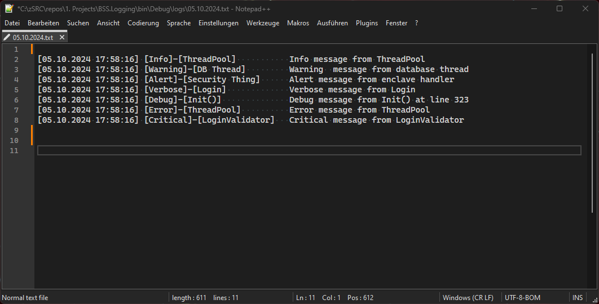

# What is this?

A simple, readable and thread safe runtime and debug logging implementation.

### Features
- Automatic Console allocation for non-Console apps in Debug mode
- Clear log format with configurable padding
- Thread safe (normal locking)
- Easy to use

Note: Whether the applications is currently running in debug mode is determined by `#if DEBUG ... #endif` and the `[Conditional("DEBUG")]` method attribute, which prevents code from getting compiled into release binaries.

# Sample Debug Output

# Sample Log file Output

# Getting Started

1. Copy the `Logging` directory into your solution
2. Add `using BSS.Logging;` to your `.cs` file to import the namespace
3. Initialize the `Log` class with `Log.Initialize();` (you may want to pass a path to the log output directory (default is ./logs) and/or the padding width)

Now, for example, you can call:
>    Log.FastLog("Info message from ThreadPool", LogSeverity.Info, "ThreadPool");

This will output to the log file, and in debug mode, write to the console.

Or to just write to the console in debug mode:
>    xDebug.WriteLine("direct console write");

---

Note: You can manually invoke the initialization of the `xDebug` class, but this should normally not be necessary (static constructor)
`xDebug.IsInitialized` should always return `true` (checking this value will initialize the class)